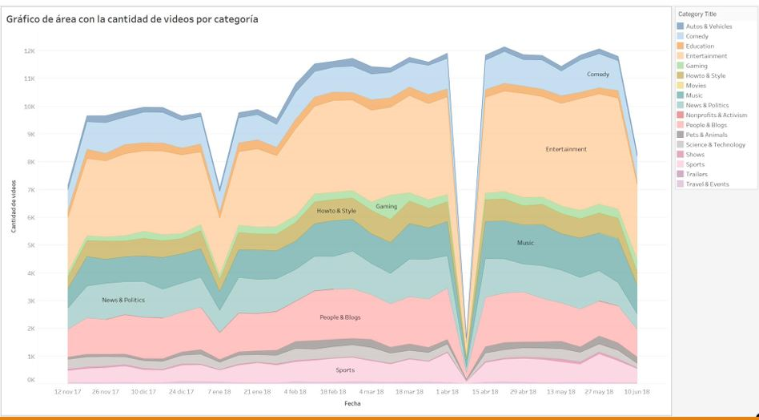
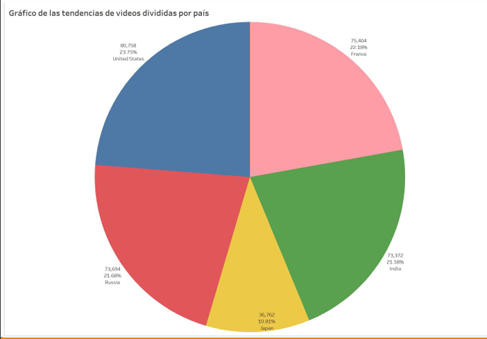
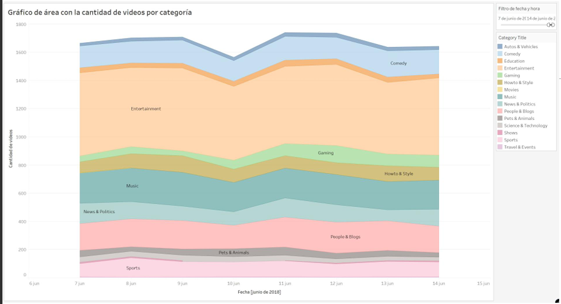
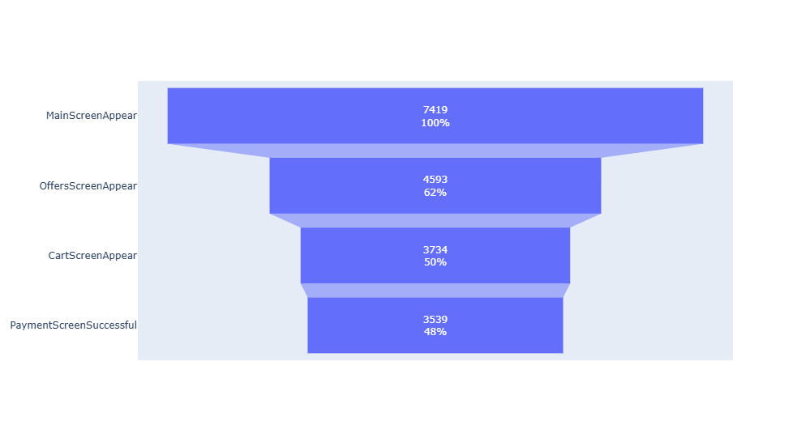
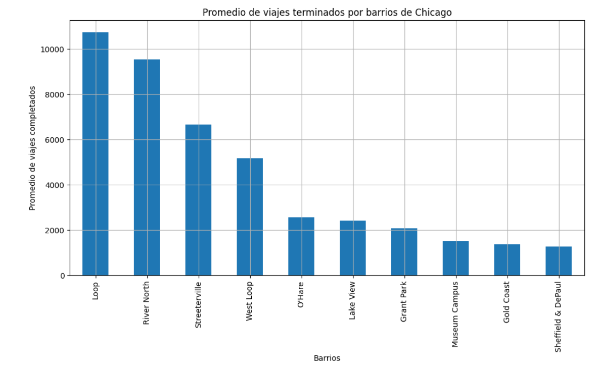
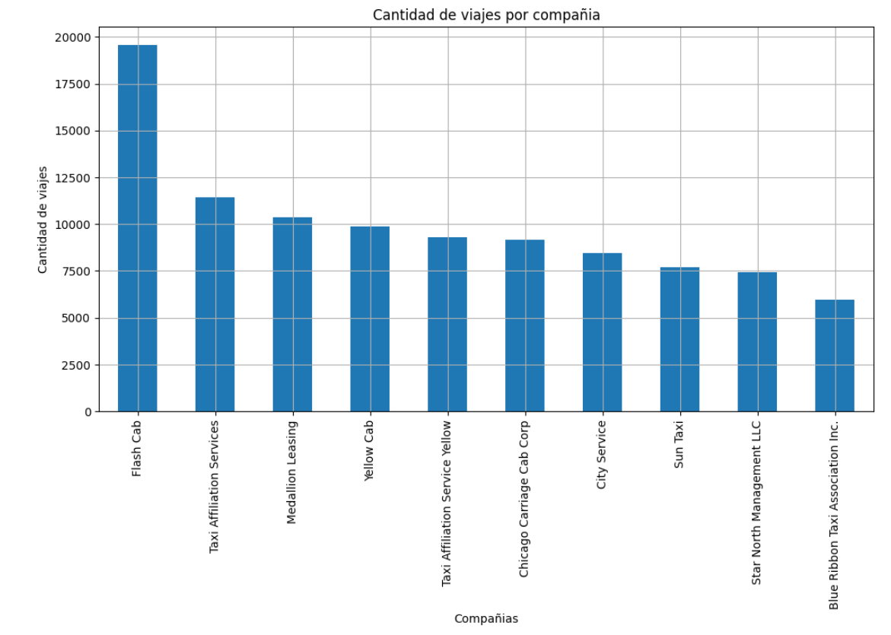

# Analista de datos

## Acerca de mí
Analista de Datos meticuloso y orientado al detalle, con sólida experiencia en la extracción, procesamiento y gestión 
eficiente de grandes volúmenes de información. 

Con formación en el área de la salud, con conocimientos en nutrición y área hospitalaria.

## Habilidades tecnológicas

Experiencia en el uso de herramientas como SQL, Python y Tableau para transformar datos complejos en información clara, útil y accionable que respalde la toma de decisiones estratégicas. Capacidad demostrada para identificar patrones, generar informes precisos y diseñar visualizaciones efectivas que impulsen mejoras operativas y optimicen procesos. Enfoque analítico, pensamiento crítico y compromiso con la calidad de los datos y la mejora continua.

    

## Habilidades blandas

Resolución de problemas | 
Trabajo en equipo | 
Pensamiento crítico | 
Adaptabilidad | 
Automatización de Procesos | 
Proactividad | 
Comunicación efectiva |

# Proyectos seleccionados

## Tendencia de videos, visualización de datos por medio de herramientas como Tableau.
### Descripción
Por medio de herramientas que permiten la automatización de recursos, podremos conocer de manera fácil y sencilla lo que nos dicen los datos, para una toma de decisiones adecuadas.

### Objetivo
Analizaremos las tendencias en videos de la plataforma YouTube para la agencia de publicidad 
Sterlig & Draper, con el objetivo de conocer el contenido de videos mas populares donde se 
debe enfocar la mercadotecnia para el publico objetivo.
 Por medio de herramientas que permiten la automatización recursos, podremos conocer de 
manera fácil y sencilla lo que nos dicen los datos, para una toma de decisiones adecuada.

### Preguntas importantes
Utilizando un tablero podemos responder preguntas importantes para nuestra agencia de mercadotecnia, como: 
◦ ¿Qué categorías de videos estuvieron en tendencia más frecuentemente? 
◦ ¿Cómo se distribuiron en las regiones? 
◦ ¿Qué categorías fueron particularmente populares en los Estados Unidos? 
◦ ¿Hubo diferencias entre las categorías populares en Estados Unidos y en otros lugares?

### Visualizaciones destacadas

Las tres principales tendencias de forma descendente son Autos y vehículos, Comedia y Educación.

Las regiones presentes en nuestros datos como primer país liderando las tendencias son Estados Unidos seguido de Francia, Rusia, India y Japón.

### Automatización
Por último, si quisiéramos conocer qué categorías de videos estuvieron en tendencia en un período de tiempo como una semana, gracias a las herramientas de automatización podemos conocer esto.
Como podemos observar el entretenimiento, la música, la comedia y los blogs, son categorías releventes para la mercadotecnia en la última semana de nuestros datos.

### Conclusión
Las herramientas como Tableau son fundamentales para transformar datos en información visualmente comprensible y accionable. Facilitan la creación de gráficos, paneles interactivos y análisis en tiempo real, lo que permite a las organizaciones tomar decisiones informadas basadas en datos. Además, son útiles para identificar patrones, optimizar procesos y comunicar hallazgos de manera efectiva.

### Si quieres conocer más de este tema [visita mi proyecto](https://github.com/0dise0/Tendencia-de-videos-Dashboard-Tableau)

## Análisis del comportamiento de usuarios en aplicaciones
### Descripción

EL objetivo principal consiste en aumentar las ventas de nuestra empresa que vende productos alimenticios, esto lo podremos lograr al analizar los datos que obtuvimos de la realización de un test A/A/B que consiste en comprobar si los cambios realizados en la aplicación pueden mejorar las ventas. Analizando nuestros datos podremos llegar a concluir si los cambios tuvieron una relevancia o no en las ventas, por lo que debemos explorar nuestros datos y limpiarlos de posibles errores que puedan comprometer nuestro análisis.

## Preguntas importantes
Primero, estudia el embudo de ventas. Descubre cómo los usuarios y las usuarias llegan a la etapa de compra. ¿Cuántos usuarios o usuarias realmente llegan a esta etapa? ¿Cuántos se atascan en etapas anteriores? ¿Qué etapas en particular?

## Aplicación de pruebas
Luego, observa los resultados de un test A/A/B. (Sigue leyendo para obtener más información sobre los test A/A/B). Al equipo de diseño le gustaría cambiar las fuentes de toda la aplicación, pero la gerencia teme que los usuarios y las usuarias piensen que el nuevo diseño es intimidante. Por ello, deciden tomar una decisión basada en los resultados de un test A/A/B.

Los usuarios se dividen en tres grupos: dos grupos de control obtienen las fuentes antiguas y un grupo de prueba obtiene las nuevas. Descubre qué conjunto de fuentes produce mejores resultados.

Crear dos grupos A tiene ciertas ventajas. Podemos establecer el principio de que solo confiaremos en la exactitud de nuestras pruebas cuando los dos grupos de control sean similares. Si hay diferencias significativas entre los grupos A, esto puede ayudarnos a descubrir factores que pueden estar distorsionando los resultados. La comparación de grupos de control también nos dice cuánto tiempo y datos necesitaremos cuando realicemos más tests.

Utilizarás el mismo dataset para el análisis general y para el análisis A/A/B. En proyectos reales, los experimentos se llevan a cabo constantemente. El equipo de análisis estudia la calidad de una aplicación utilizando datos generales, sin prestar atención a si los usuarios y las usuarias participan en experimentos.

## Descripción de los datos

Cada entrada de registro es una acción de usuario o un evento.

EventName: nombre del evento.
DeviceIDHash: identificador de usuario unívoco.
EventTimestamp: hora del evento.
ExpId: número de experimento: 246 y 247 son los grupos de control, 248 es el grupo de prueba.

Poder crear diagramas de embudo nos permite conocer el proceso por el cual las personas pasan hasta realizar la compra y saber que porcentaje de estas se quedaron en diferentes etapas, esto nos ayuda a ver el comportamiento de los clientes.

## Conclusión
Nuestro objetivo principal consistió en aumentar las ventas para nuestra empresa que vende productos alimenticios, una de las formas para realizar esto fue realizar un test A/A/B para comparar los cambios realizados en la aplicación donde se realizan las compras, de esta forma podremos comprobar si los cambios realizados tuvieron un valor significativo en las ventas o si los cambios realizados no afectaron positivamente en estas.
Una vez que agrupamos a los usuarios para cada evento en nuestros datos, estudiamos el embudo de eventos por los que los usuarios pasaron para realizar una compra exitosa, de igual forma calculamos el porcentaje de conversión y la tasa de pérdida de usuarios para cada evento en su secuencia, como pudimos observar en la etapa de pantalla principal a la de ofertas es donde perdemos más usuarios con un 38% de pérdida, del 100% de los usuarios solo el 48% completa una compra exitosa.

### Si quieres conocer más de este tema [visita mi proyecto](https://github.com/0dise0/Comportamiento-de-usuarios-en-aplicaciones/tree/main)

## Patrones en las preferencias de los pasajeros para una empresa de viajes compartidos
### Descripción
Trabajando como analista para Zuber, una nueva empresa de viajes compartidos que se está lanzando en Chicago. La tarea es encontrar patrones en la información disponible. Quieres comprender las preferencias de los pasajeros y el impacto de los factores externos en los viajes.
Al trabajar con una base de datos, analizarás los datos de los competidores y probarás una hipótesis sobre el impacto del clima en la frecuencia de los viajes.

### Objetivo
El objetivo principal del proyecto es analizar patrones con la información disponible para comprender cómo los factores externos como el clima, impacta en las preferencias de los pasajeros para el año 2017 y meses de noviembre. 

### Metodología
Iniciamos con la importación de librerías para poder explorar los datos que disponemos, buscando que los valores sean los adecuados para las columnas, buscando valores duplicados, nulos y de ser necesario crear nuevas variables a partir de los datos para poder profundizar en el análisis. Una vez que terminamos con la corrección de nuestros datos podemos empezar con el análisis de nuestros datos agrupando variables para poder crear gráficas, al igual que podemos filtrar información para obtener información más precisa sobre nuestras variables. Después de analizar nuestros datos podremos obtener conclusiones útiles que nos permitirán alcanzar nuestro objetivo.

### Exploración de datos
Para comenzar con la exploración de datos debemos identificar cómo han sido recopilados los datos y de ser necesario cambiar valores en las respectivas columnas, tratar los valores ausentes o duplicados, para poder abrir nuestro archivo debemos importar la librería de pandas para poder mostrar la información y observar cómo esta estructurado el dataframe.

### Visualizaciones destacadas

Una vez terminada la etapa de preparación de datos proseguimos con la etapa de análisis de datos, donde identificamos los diez principales barrios que donde finalizan los viajes. 

Los barrios de Chicago que en promedio tiene más viajes terminados es el barrio de Loop, seguido de River North en segundo lugar, Streeterville en tercero, West Loop en cuarto lugar y en quinto el barrio de O´Hare donde se encuentra localizado el Aeropuerto Internacional, considerando estos barrios como los más comunes en completar los recorridos de 94 barrios registrados en nuestros datos. 

Para visibilizar esta información elaboramos un gráfico de barras para mostrar de forma visual los barrios con más viajes como destino. Además identificamos las diez empresas competidoras con un mayor conteo de viajes realizados, la empresas con mayor cantidad de viajes realizados es 'Flash Cab' con un total de 19,558 viajes realizados, en segundo lugar la empresa 'Taxi Affiliation Services' con 11,422 viajes realizados representando un poco más de la mitad de la primer empresa, en tercer lugar 'Medallion' Leasing con 10,367 y en cuarto lugar 'Yellow Cab' con 9,888 viajes. 

Los demás lugares tienen menos de la mitad de los viajes realizados por la empresa que está en primer puesto en cantidad de viajes realizados. De igual forma que el análisis anterior, realizamos un gráfico de barras para visibilizar el conteo de los viajes de las empresas competidoras.

### Conclusión
Finalmente realizamos una prueba de hipótesis para conocer si no existía alguna diferencia en la duración de los viajes realizados los días sábados cuando el clima varía ya sea con buen clima o con un clima lluvioso, al realizar la prueba obtuvimos un valor menor a p=0.05 por lo que rechazamos la hipótesis nula y podemos considerar que si existe diferencia entre la duración del tiempo de viaje en los diferentes climas. Al calcular el promedio de duración de viaje para los diferentes climas, podemos observar que en días con un buen clima se realizan en promedio 33 minutos en llegar del barrio Loop al aeropuerto, mientras que cuando hay un mal clima en promedio de tiempo, el viaje se efectúa en 40 minutos, siendo una diferencia de 7 minutos en promedio que dura más el viaje hacia el aeropuerto cuando los días tienen un mal clima. 

#### Respuesta al objetivo principal
Respondiendo a nuestro objetivo principal y podemos decir que los patrones de viaje de los pasajeros se ven afectados con las variaciones de clima, principalmente cuando hay lluvia, esto influye en la duración del viaje ya que es posible que exista inundaciones en el trayecto, accidentes o alguna otra consecuencia que afecte al tráfico de vehículos por lo que la duración en el tiempo del viaje es mayor a los climas donde no hay lluvia.

### Si quieres conocer más de este tema [visita mi proyecto](https://github.com/0dise0/Patrones-en-las-preferencias-de-los-pasajeros-para-una-empresa-de-viajes-compartidos/tree/main)

### Si quieres conocer mas de mi te invito a visitar mi página de [LinkedIn](www.linkedin.com/in/augusto-mérida-garcía)

### Y si quieres conocer sobre mis proyectos de invito a visitar [mi repositorio](https://github.com/0dise0)

